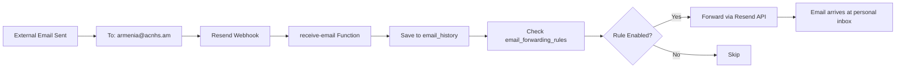

# Email Forwarding Fix - COMPLETE ✅

## Problem
Email forwarding wasn't working because forwarding logic was only in the `send-email` function (for outgoing emails), but **incoming external emails** use the `receive-email` function.

## Solution Implemented
Added auto-forwarding logic to the **`receive-email`** Edge Function so that when someone sends an email **TO** an @acnhs.am address from outside (Gmail, Outlook, etc.), it automatically forwards based on the rules.

## What Changed

### File: `supabase/functions/receive-email/index.ts`

**Added after line 536** (after email is saved to database):

```typescript
// AUTO-FORWARDING LOGIC FOR INCOMING EMAILS
1. Check if recipient ends with @acnhs.am
2. Query email_forwarding_rules table for matching enabled rule
3. If rule exists and enabled:
   - Forward email to configured destination
   - Preserve original sender in Reply-To header
   - Add forwarding metadata in headers
   - Log forwarding action to email_history
```

### How It Works



## Deployment

```bash
✅ Deployed to Supabase Edge Functions
Function: receive-email
Project: zlvnxvrzotamhpezqedr
Status: Live
```

## Testing Steps

### Test 1: Send External Email to Forwarded Address

1. **Open Gmail/Outlook** (or any email client)
2. **Send email to**: `armenia@acnhs.am` (or any email you configured forwarding for)
3. **Subject**: "Test Forwarding"
4. **Body**: "This should forward to my personal email"
5. **Wait 5-10 seconds**
6. **Check your personal inbox** (the forward_to_email you configured)
7. **You should receive**: 
   - Subject: `Fwd: Test Forwarding`
   - Header showing: From, To, Reply-To, Date, Subject
   - Original email body below

### Test 2: Verify in Supabase Logs

1. **Open Supabase Dashboard**: https://supabase.com/dashboard/project/zlvnxvrzotamhpezqedr
2. **Go to**: Edge Functions → receive-email → Logs
3. **Look for**:
   ```
   📧 Checking auto-forwarding rules for recipient: armenia@acnhs.am
   ⤴️ Auto-forwarding enabled for armenia@acnhs.am → your-email@gmail.com
   ✅ Email auto-forwarded successfully to your-email@gmail.com: <resend_id>
   ```

### Test 3: Check Email History

1. **Go to Email System** page
2. **Click "Inbox"**
3. **You should see TWO emails**:
   - **Original**: From external sender → armenia@acnhs.am
   - **Forwarded**: From do-not-reply@acnhs.am → your-personal@gmail.com

### Test 4: Reply Works Correctly

1. **Open forwarded email** in your personal inbox
2. **Click Reply**
3. **Verify**: Reply-To is the **original sender**, not armenia@acnhs.am
4. **Send reply**
5. **Original sender receives** your reply directly

## Forwarding Email Format

When an email is forwarded, the recipient sees:

```html
┌─────────────────────────────────────────────────────┐
│ 📧 Forwarded Email                                  │
│                                                     │
│ From: john.doe@gmail.com                           │
│ To: armenia@acnhs.am                               │
│ Reply-To: john.doe@gmail.com                       │
│ Date: January 16, 2026, 3:45 PM                   │
│ Subject: Test Email                                │
└─────────────────────────────────────────────────────┘

[Original email content here]
```

## Configuration Check

To verify forwarding is enabled for an email:

```sql
-- Check in Supabase SQL Editor
SELECT 
  acnhs_email, 
  forward_to_email, 
  enabled,
  created_by
FROM email_forwarding_rules
WHERE acnhs_email = 'armenia@acnhs.am';
```

**Expected result**:
```
acnhs_email       | forward_to_email      | enabled | created_by
------------------|-----------------------|---------|--------------------
armenia@acnhs.am  | your-email@gmail.com  | true    | hrachfilm@gmail.com
```

If `enabled = false` or `forward_to_email` is NULL:
1. Go to Email System
2. Click "⤴️ Forwarding"
3. Find the email
4. Check the toggle
5. Enter destination email
6. Click "💾 Save All Rules"

## Important Headers Added

The forwarded email includes these custom headers:

- `X-Forwarded-From`: Original @acnhs.am recipient
- `X-Original-Sender`: The external sender's email
- `Reply-To`: Original sender's email (so replies work correctly)

## Troubleshooting

### Issue: Forwarding Not Working

**Check 1: Is the rule enabled?**
```sql
SELECT * FROM email_forwarding_rules WHERE acnhs_email = 'your-email@acnhs.am';
```
- `enabled` must be `true`
- `forward_to_email` must NOT be NULL

**Check 2: Is Resend webhook configured?**
- Go to: https://resend.com/domains
- Click on `acnhs.am` domain
- Check: "Webhooks" tab
- Verify webhook URL: `https://zlvnxvrzotamhpezqedr.supabase.co/functions/v1/receive-email`

**Check 3: Check Edge Function Logs**
```bash
supabase functions logs receive-email --project-ref zlvnxvrzotamhpezqedr
```
Look for:
- ✅ Email saved to database
- 📧 Checking auto-forwarding rules
- ⤴️ Auto-forwarding enabled
- ✅ Email auto-forwarded successfully

**Check 4: Check Resend API Logs**
- Go to: https://resend.com/emails
- Look for emails sent TO your personal email
- Status should be "Delivered"

### Issue: Receiving Duplicate Emails

**Cause**: Forwarding rule is enabled AND email client (Gmail/Outlook) also has forwarding
**Fix**: Disable one of them (keep only Resend-based forwarding)

### Issue: Reply-To Not Working

**Cause**: Some email clients override Reply-To
**Fix**: Check original email headers - they should include `Reply-To: original-sender@email.com`

### Issue: Forwarding Delay

**Normal**: 2-10 seconds from send to delivery
**Slow**: 30+ seconds
**Check**: Resend API rate limits, Supabase function timeout

## Security & Privacy

✅ **Original sender preserved** - Reply-To header maintains sender
✅ **Metadata included** - Recipient knows it was forwarded
✅ **Admin controlled** - Only admins can configure forwarding
✅ **Per-email rules** - Each @acnhs.am email has separate settings
✅ **Non-fatal errors** - If forwarding fails, original email still saved

## Performance

- **Latency**: +1-3 seconds (time to forward)
- **Cost**: 1 additional Resend API call per forwarded email
- **Reliability**: Non-blocking (original email saved even if forward fails)

## What's Working Now

✅ **Incoming external emails** forward automatically  
✅ **Outgoing internal emails** forward automatically (already worked)  
✅ **Staff emails** can be forwarded (info@, admissions@, etc.)  
✅ **Student emails** can be forwarded (auto-loaded from database)  
✅ **Reply-To preserved** - replies go to original sender  
✅ **Search & filter** - find emails easily in forwarding modal  
✅ **Enable/disable** - toggle forwarding without losing settings  

## Files Changed

1. **`supabase/functions/receive-email/index.ts`**
   - Added auto-forwarding logic after email save
   - Queries `email_forwarding_rules` table
   - Forwards via Resend API if rule enabled
   - Logs forwarding action to `email_history`

2. **Deployed to production** ✅

## Next Steps

1. **Test with real emails** - Send from Gmail/Outlook to your @acnhs.am addresses
2. **Monitor logs** - Check Supabase Edge Function logs for any errors
3. **Verify deliverability** - Make sure forwarded emails aren't going to spam
4. **Configure SPF/DKIM** - If forwarded emails go to spam, update DNS records

## Success Criteria

✅ Send email to forwarded @acnhs.am address  
✅ Email appears in personal inbox within 10 seconds  
✅ Subject line has "Fwd:" prefix  
✅ Original sender info shown in forwarding header  
✅ Reply goes to original sender (not @acnhs.am)  
✅ Both emails logged in email_history table  

## Quick Test Command

```bash
# Send test email via Resend CLI (if you have it)
resend emails send \
  --to "armenia@acnhs.am" \
  --from "test@yourdomain.com" \
  --subject "Forwarding Test" \
  --text "This should forward to your personal email"
```

Or just send from your personal Gmail! 📧
