# Student Email Forwarding - Complete ✅

## Overview
Added automatic student email forwarding feature to the email forwarding system. Student emails are now dynamically loaded from the `acnhs_students` table and shown in a separate tab.

## Features Added

### 1. **Two-Tab Interface**
- **👔 Staff Emails Tab** - Manual ACNHS email addresses (info@, admissions@, etc.)
- **🎓 Student Emails Tab** - Automatic student email addresses from database

### 2. **Automatic Student Email Loading**
- Queries `acnhs_students` table on modal open
- Fetches all students with valid email addresses
- Shows student metadata: Name, Student ID, Enrollment Status
- Auto-updates when new students are enrolled

### 3. **Enhanced Student Display**
Each student email shows:
- **Email address** (e.g., `j.doe@acnhs.am`)
- **👤 Full Name** (e.g., "John Doe")
- **🆔 Student ID** (e.g., "ACNHS-0000123")
- **📊 Enrollment Status** (e.g., "enrolled", "active")

### 4. **Unified Forwarding Rules**
- Staff and student emails stored in same `email_forwarding_rules` table
- Each email can have individual forwarding destination
- Enable/disable toggle per email
- Save all rules at once (staff + student)

### 5. **Visual Differentiation**
- **Staff emails**: Teal/cyan theme (`#2dd4bf`)
- **Student emails**: Purple theme (`#a78bfa`)
- Different border colors to distinguish types

## How It Works

### When Modal Opens
```javascript
1. Load staff emails (from admin_users.email_permissions + created emails)
2. Load student emails (from acnhs_students table)
3. Fetch existing forwarding rules for both
4. Render both tabs
5. Default to "Staff Emails" tab
```

### Student Email Query
```sql
SELECT id, student_id, full_name, email, enrollment_status
FROM acnhs_students
WHERE email IS NOT NULL
ORDER BY full_name ASC;
```

### When Saved
```javascript
1. Validate all enabled rules have valid email addresses
2. Combine staff + student rules into single array
3. Upsert to email_forwarding_rules table
4. Show success: "✅ Saved X rules (Y staff, Z student)"
```

## Database Structure

### acnhs_students Table
```sql
- id (uuid)
- student_id (text) - e.g., "ACNHS-0000123"
- full_name (text)
- email (text) - Student's institutional email
- enrollment_status (text) - e.g., "enrolled", "active"
```

### email_forwarding_rules Table
```sql
- id (uuid)
- acnhs_email (text, UNIQUE) - Source email (staff or student)
- forward_to_email (text, NULLABLE) - Destination email
- enabled (boolean) - Forwarding on/off
- created_by (text) - Admin who created rule
```

## User Interface

### Staff Emails Tab
```
👔 Staff Emails
├── admissions@acnhs.am         [✓] → admin@gmail.com
├── info@acnhs.am               [ ] → (disabled)
├── documents@acnhs.am          [✓] → records@gmail.com
└── [➕ Add Staff Email button]
```

### Student Emails Tab
```
🎓 Student Emails
├── j.doe@acnhs.am              [✓] → john.doe@gmail.com
│   👤 John Doe • 🆔 ACNHS-0000123 • 📊 enrolled
├── m.smith@acnhs.am            [ ] → (disabled)
│   👤 Mary Smith • 🆔 ACNHS-0000124 • 📊 active
└── (No "Add" button - auto-populated from database)
```

## Search Functionality

Works across both tabs:
- **Staff tab**: Search by email prefix (info, admissions, hrach)
- **Student tab**: Search by email, name, or student ID
- Real-time filtering as you type
- Result count display

Example searches:
- `"john"` → Finds john@acnhs.am, john.doe@acnhs.am
- `"0000123"` → Finds student with ID ACNHS-0000123
- `"enrolled"` → Shows all emails containing "enrolled"

## Testing Steps

### Test 1: View Student Emails
1. **Login as admin** (hrachfilm@gmail.com)
2. **Go to Email System** page
3. **Click "⤴️ Forwarding"** button
4. **Click "🎓 Student Emails"** tab
5. **Verify**: Should see list of all students with emails

### Test 2: Configure Student Forwarding
1. **Open forwarding modal**
2. **Go to Student Emails tab**
3. **Check one student's checkbox**
4. **Enter forwarding email** (e.g., personal@gmail.com)
5. **Click "💾 Save All Rules"**
6. **Verify**: Success message shows staff + student count

### Test 3: Search Across Tabs
1. **Open forwarding modal**
2. **Staff tab**: Search for "info" → Should filter staff emails
3. **Switch to Student tab**: Search for student name
4. **Verify**: Both searches work independently

### Test 4: Automatic Student Addition
1. **Go to Admin Applications**
2. **Change applicant status to "enrolled"**
3. **System creates student record with email**
4. **Open forwarding modal → Student Emails tab**
5. **Verify**: New student email appears automatically!

## Edge Cases Handled

### No Students Yet
Shows friendly empty state:
```
🎓
No Student Emails Yet
Student emails will appear here automatically when
their enrollment status changes to "enrolled".
```

### Missing Email Addresses
- Students without emails are filtered out
- Only shows students with valid `@` in email field

### Database Errors
- Gracefully handles if `acnhs_students` table doesn't exist
- Shows staff emails even if student query fails
- Doesn't block modal from opening

### Duplicate Emails
- Unique constraint on `email_forwarding_rules.acnhs_email`
- Upsert operation prevents duplicates
- Same email can't have multiple rules

## Auto-Sync Behavior

Student emails **automatically sync** when:
1. ✅ Modal is opened (queries latest from database)
2. ✅ New student is enrolled (email added to acnhs_students)
3. ✅ Student email is updated in database
4. ✅ Page is refreshed and modal reopened

**No manual sync needed** - always shows current database state!

## Security Notes

- Only admins can access forwarding settings
- Email forwarding only works for `@acnhs.am` domains
- Student personal emails are not shown (only institutional)
- Forwarding destination is admin-controlled

## Success Criteria

✅ Staff and student emails separated into tabs  
✅ Student emails auto-loaded from acnhs_students table  
✅ Shows student name, ID, and enrollment status  
✅ Search works across both tabs  
✅ Save handles both staff + student rules  
✅ Visual distinction (teal vs purple theme)  
✅ Empty state for no students  
✅ Real-time sync with database  

## Files Changed

**email-system.html**
- Added student email tab UI
- Added `loadStudentEmails()` function
- Added `renderStudentForwardingRulesList()` function
- Added `switchForwardingTab()` function
- Updated `saveForwardingSettings()` to handle both types
- Updated modal header and description

## What Happens When Student is Enrolled

```mermaid
graph LR
A[Admin Changes Status to 'enrolled'] --> B[System Creates Student Record]
B --> C[Student Email Assigned]
C --> D[Email Stored in acnhs_students.email]
D --> E[Admin Opens Forwarding Modal]
E --> F[loadStudentEmails Queries Database]
F --> G[Student Email Shows in Tab]
G --> H[Admin Configures Forwarding]
H --> I[Rule Saved to email_forwarding_rules]
```



## Future Enhancements

Possible additions:
- [ ] Bulk enable/disable for all students
- [ ] Filter students by enrollment status
- [ ] Export student email list to CSV
- [ ] Set default forwarding pattern (e.g., all to registrar@)
- [ ] Email forwarding statistics/analytics
- [ ] Notification when new student email is created
